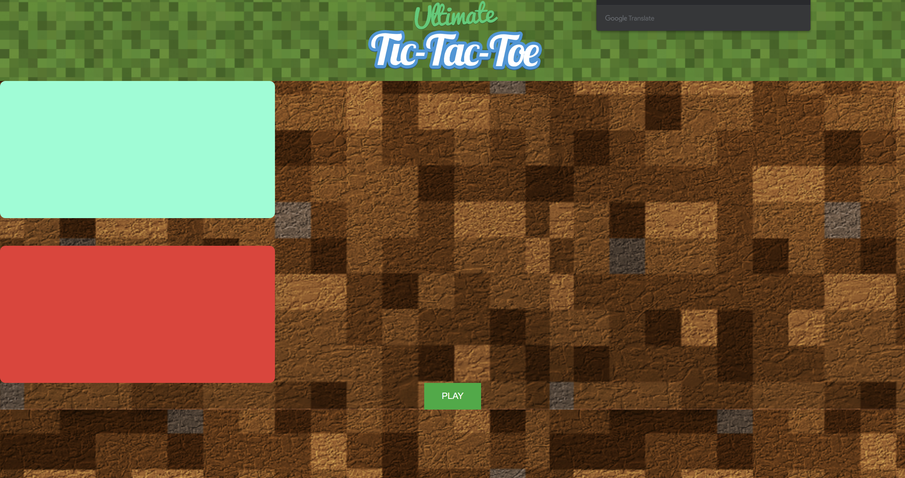
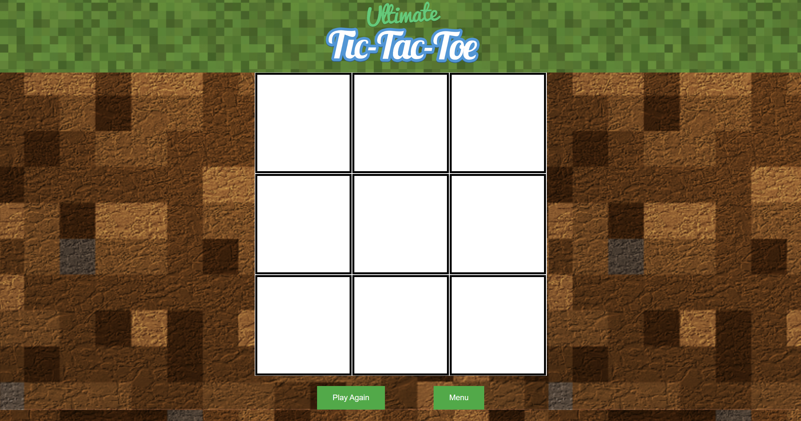
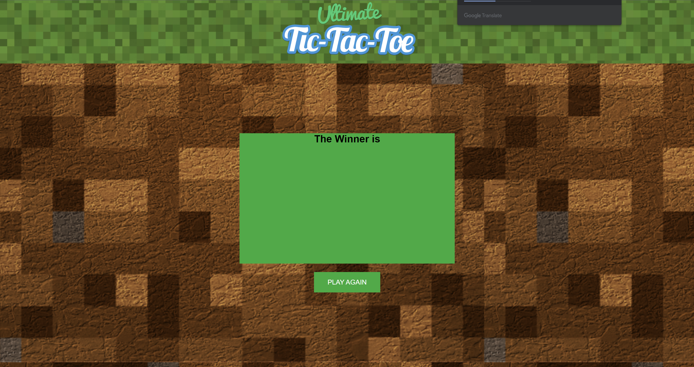

# TIC TAC TOE

## About the project 🔎
This is the first part of the project, where we can see the first three pages of it, which would be the beginning of the game made up of game info, players, start button

On the second page the tictactoe game is integrated as such, it is only implemented what would be the skeleton of the game with some styles and different images

On the third and last page we have the winner of the previous game and the button that takes you to the start again to choose who to play with and start again.

## Objective 🎯
The objective of this projector is that the viewer can see the beginning of the project, seeing part by part the pages created for the future implementation of javascript to give full functionality to the game. 
  

## Stack

 

## Views
Menu view

Game view

 

Winner view

Play the demo here <a href="">TIC TAC TOE</a>

## License
This project is under license from Luis Guerrero

## Webgrafia:
To achieve my goal I have collected information from:

## Thanks to:

To the profesor Fidel Gilart

## Contacto

 

